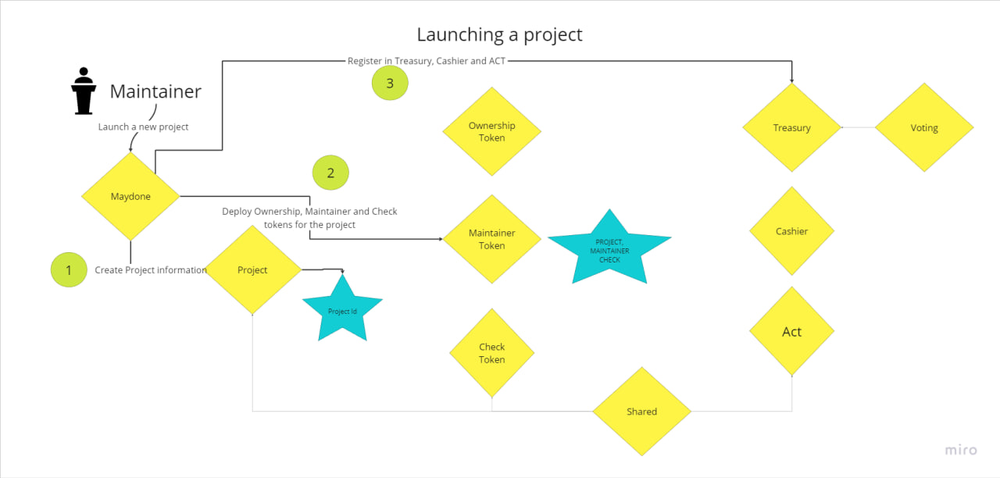
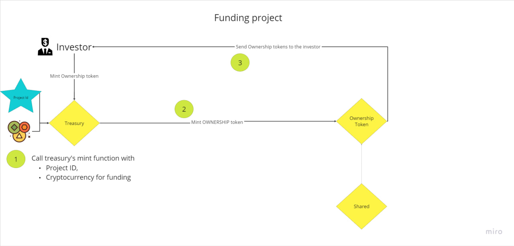
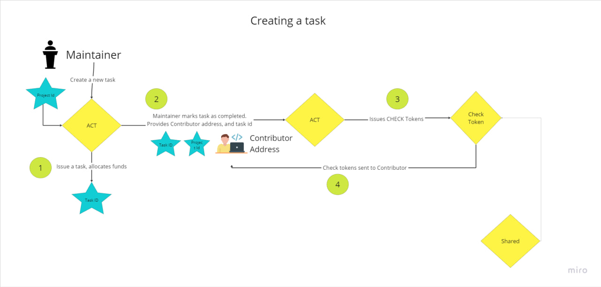
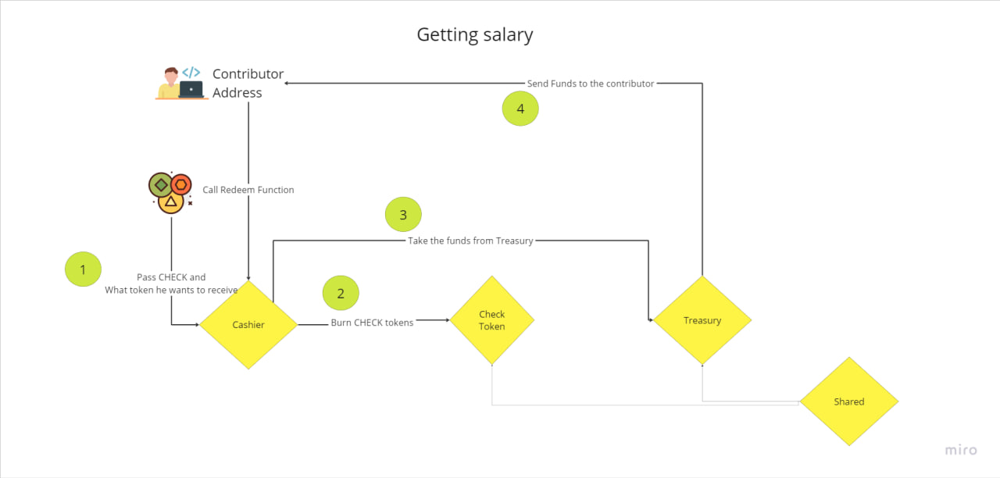

# Ara smartcontracts version 1

##### What is Ara?
Ara is a collaboration software that integrates all project management tools such as Trello, Chat, Idea sharing in one place. 

One of the two advantages of Ara compared to other project management services is enabling a collaboration of strangers. For this case, Ara also includes a kickstarter like launchpad. Ara itself handles the collaboration security and transparency between parties.

For security, and transparency Ara utilizes the blockchain.
The project's assets are converted into a cryptocurrency. The project's settings, and its ownership is tracked on blockchain as well.

This repository contains the smartcontracts for Ethereum Virtual Machines. In a blockchain, the smartcontract is the terminology to indicate the programs.

## How it works?

> Source code is stored in `contracts/V1` directory.

List of smartcontracts:
* `OwnershipTokenV1.sol`
* `MaintainerTokenV1.sol`
* `CheckTokenV1.sol`
* `VotingV1.sol`
* `ProjectV.sol`
* `ActV1.sol`
* `CashierV1.sol`
* `TreasuryV1.sol`
* `MaydoneV1.sol`

Let's start the explanation of smartcontracts by explaining types of Ara users. In Ara, there are three category of stakeholders. Each category is represented by it's own token.

* Owners &ndash; of the project. They hold the project's Tokens. This token is written on `OwnershipTokenV1.sol`
* Maintainers &ndash; are the admins who handles the project development. They are holders of "Main_<project_name>" tokens. This token is written on `MaintainerTokenV1.sol`
* Contributors &ndash; are the developers of the project. They are holders of "Check_<project_name>" tokens which is written on `CheckTokenV1.sol`

Owners manage the project's resources as the resources are the key aspect of any project. As resource we include a private keys, the money that project has. They can grant all other stakeholders the necessary resources on demand. The project resource management is written on `ProjectV1.sol`.

We expect that most of the projects will be a collaborative effort. As a collaborative decision, we use the voting mechanism. For example, to grant the maintainers a certain amount of funds. The voting mechanism is written on `VotingV1.sol`.

Once maintainers got the tokens they hold the responsibility for the development that's worth that amount of tokens. They split the goal into smaller chunks, and post them in the development board, or hire freelancers. For completion the contributors get the check tokens. Tasks that are backed by the funds, and administrated by the maintainers is implemented on the `ActV1.sol` smartcontract.

For each task completion, the contributors receive a Check token. A contributor may swap the check tokens for funds. Either getting the token's tokens for a discount, or get Bitcoin, stable coin to spend on their daily lives. The swap of Check for the actual tokens is hold on a special smartcontract called `CashierV1.sol`.

Finally, as we have many projects, each with it's own tokens, contributions, and maintainership, we have a special smartcontract that initiates the project including it's Treasury, Stakeholder tokens. This smartcontract is called `MaydoneV1.sol`.

The goal of Maydone is to initiate the project in a one transaction. Link the various parts of project smartcontracts to each other.

To initiate a new project, simply call the `Launch` method of Maydone. This method creates various tokens. And a person who is initiating is the main maintainer of the project.

A project, and a task are special data that carry additional payload to use on offchain. This payload is then printed on various platforms outside of the blockchain. Representing them on the crypto allows first its management by the token holders, as well as its transparency.

For the projects and its tasks we use Tableland service.

## Ara
Ara as a project itself uses this smartcontract mechanism. Ara's resources include the control over the Maydone smartcontract as one of its primary use.

> For use, Ara deducts 10% fee from the token mints. Which goes to the special wallet. 
> It's a temporary as we have only few clients. As it gets popular, we will improve on this aspect toward making it almost for free.

In Ara, unlike the mainstream crypto currencies, any project token mint must be collaterized. This collaterized tokens are then used to fund in exchange for the Swaps. The colleteral management is written on the `TreasuryV1.sol`.

# Deployment

Deploy each smartcontracts in order defined in `scripts/v1` directory.

#### Project

* Lint with maydone by calling `setMaydone`;

#### Maydone
* Lint with project by calling `setProject` and pass the deployed projectV1 address.
* Lint with Treasury by calling `setTreasury` and pass the deployed treasury address.
* Lint with Cashier by calling `setCashier`
* Lint with Act by calling `setAct`

#### Treasury
* Lint with the maydone by calling `setMaydone`
* Lint with the voting by calling `setVoting`
* Lint with the cashier by calling `setCashier`
* Lint with Ara Sangha by calling `setAraSangha`

#### Cashier
* Lint with the maydone
* Lint with the treasury

#### Act
* Lint with the maydone

### Add collateral
In the treasury, add the collateral. On Readme, in the BNB Testnet/BNB sections you will see the chainlink documentation 
to get the Chainlink Feed decimals and token address.

# Smartcontract Flow

Launching a project initiated by the maintainer.

Then, an investor can mint ownership token, by providing a collateral

---
As the project funded, its time to work on development. The development processed in the ACT smartcontract. A maintainer creates a task.

---
A contributor who completed task collects money that project owns to him. The process to exchange Check for a investment money goes through the Cashier smartcontract.

